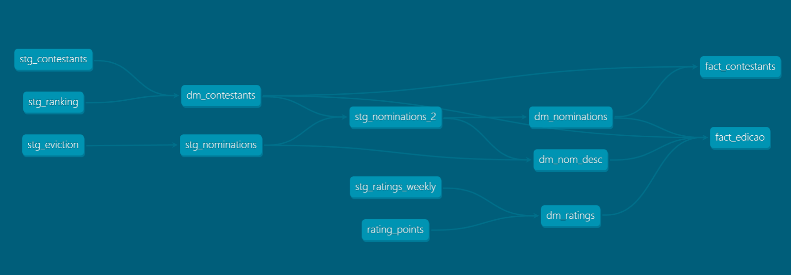

1) Create account on dbt or login.
2) Add a connection with Big Query - use the service account created for dbt
3) Connect to the bigbrotherbrasil dataset on BigQuery 
4) Link to the repository where all the files are located and deploy the project.

## Outline

- The data is scraped from Wikipedia into several tables, namely:
Contestants: with contestant demographic and show performance information
Ranking 1 to 25: 1 table per season with each contestant's final position on the show.
Nominations 1 to 25: 1 table per season with information on the nominations
Eviction results 1 to 25: 1 table per season with information on the evictions
Ratings weekly 1 to 25: 1 table per season with show ratings per day and weekly average

These tables were pre-cleaned in python before being ingested but further manipulation was needed. Besides, tables needed to be unioned when there was 1 table per season.
These steps were done in stg_contestants, stg_ranking, stg_eviction, stg_nominations (2 models were necessary due to unpivotting), and stg_ratings_weekly.

From the staging tables, the dimension tables were created with attributes by contestant (dm_contestant), by nomination round (dm_nominations and dm_nom_desc) and ratings (dm_ratings). These 4 tables - combined with a seed to convert rating points to households - then fed 2 fact tables: fact_contestant and fact_edicao (season).

